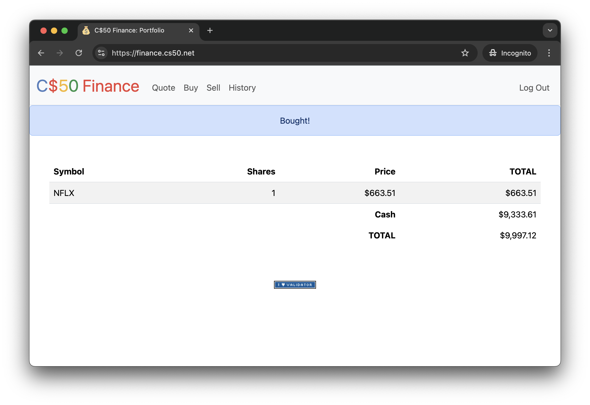

# Capstone Progress Report: 2025-06-05

## Concepts Learned:

`No new concepts learned. This is a progress update log.`

## Tasks Completed:
* Finished watching Lecture 9
* Finished Problem 1: Birthdays
* Started work on Problem 2: Finance

## Problem 1: Birthdays
<strong>The Prompt and Specification for <em>Birthdays</em> can be found <a href="../2025-06-04/summary.md">here<a>.</strong>

**Summary:**  
This is a continuation of the work completed on    `2025-06-04`. I finished the problem according to the specification found above, and included the bonus feature `Delete Birthday Entries`.

**Challenges:**  
`none`. This problem can be considered quite trivial if Lecture 9 was watched. 

**The finished code can be found in this directory's subfolder. Peruse at one's own leisure.**

---

## Problem 2: Finance
**The Task: Implement a website via which users can “buy” and “sell” stocks, à la the below.**  

You’re about to implement C$50 Finance, a web app via which you can manage portfolios of stocks. Not only will this tool allow you to check real stocks’ prices and portfolios’ values, it will also let you buy (okay, “buy”) and sell (okay, “sell”) stocks by querying for stocks’ prices.

Indeed, there are tools (one is known as IEX) that let you download stock quotes via their API (application programming interface) using URLs like https://api.iex.cloud/v1/data/core/quote/nflx?token=API_KEY. Notice how Netflix’s symbol (NFLX) is embedded in this URL; that’s how IEX knows whose data to return. That link won’t actually return any data because IEX requires you to use an API key, but if it did, you’d see a response in JSON (JavaScript Object Notation) format like this:

    {
    "avgTotalVolume":6787785,
    "calculationPrice":"tops",
    "change":1.46,
    "changePercent":0.00336,
    "close":null,
    "closeSource":"official",
    "closeTime":null,
    "companyName":"Netflix Inc.",
    "currency":"USD",
    "delayedPrice":null,
    "delayedPriceTime":null,
    "extendedChange":null,
    "extendedChangePercent":null,
    "extendedPrice":null,
    "extendedPriceTime":null,
    "high":null,
    "highSource":"IEX real time price",
    "highTime":1699626600947,
    "iexAskPrice":460.87,
    "iexAskSize":123,
    "iexBidPrice":435,
    "iexBidSize":100,
    "iexClose":436.61,
    "iexCloseTime":1699626704609,
    "iexLastUpdated":1699626704609,
    "iexMarketPercent":0.00864679844447232,
    "iexOpen":437.37,
    "iexOpenTime":1699626600859,
    "iexRealtimePrice":436.61,
    "iexRealtimeSize":5,
    "iexVolume":965,
    "lastTradeTime":1699626704609,
    "latestPrice":436.61,
    "latestSource":"IEX real time price",
    "latestTime":"9:31:44 AM",
    "latestUpdate":1699626704609,
    "latestVolume":null,
    "low":null,
    "lowSource":"IEX real time price",
    "lowTime":1699626634509,
    "marketCap":192892118443,
    "oddLotDelayedPrice":null,
    "oddLotDelayedPriceTime":null,
    "open":null,
    "openTime":null,
    "openSource":"official",
    "peRatio":43.57,
    "previousClose":435.15,
    "previousVolume":2735507,
    "primaryExchange":"NASDAQ",
    "symbol":"NFLX",
    "volume":null,
    "week52High":485,
    "week52Low":271.56,
    "ytdChange":0.4790450244167119,
    "isUSMarketOpen":true
    }
Notice how, between the curly braces, there’s a comma-separated list of key-value pairs, with a colon separating each key from its value. We’re going to be doing something very similar with our own stock database API.

---

## Capstone Status:
- [x] Problem 1  
- [ ] Problem 2   

Aside from previous delays, my schedule is proceeding surprisingly well. I am on course to completing the first problem set by `Tomorrow, 2025-06-05`, and am on track to completing the second problem set by `2025-06-09`. This is, of course, slightly behind schedule, and I may have to balance my presentation creation with my final project creation.

